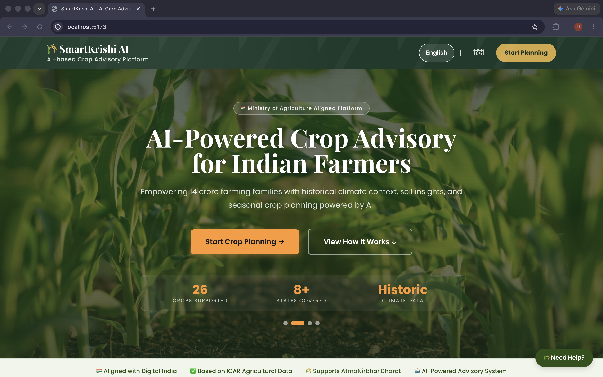
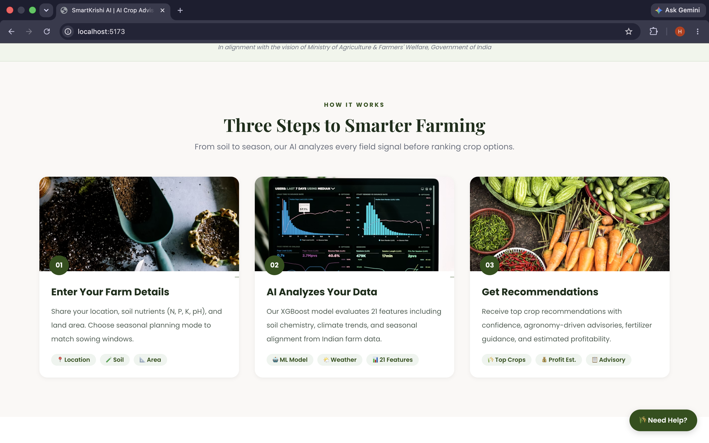
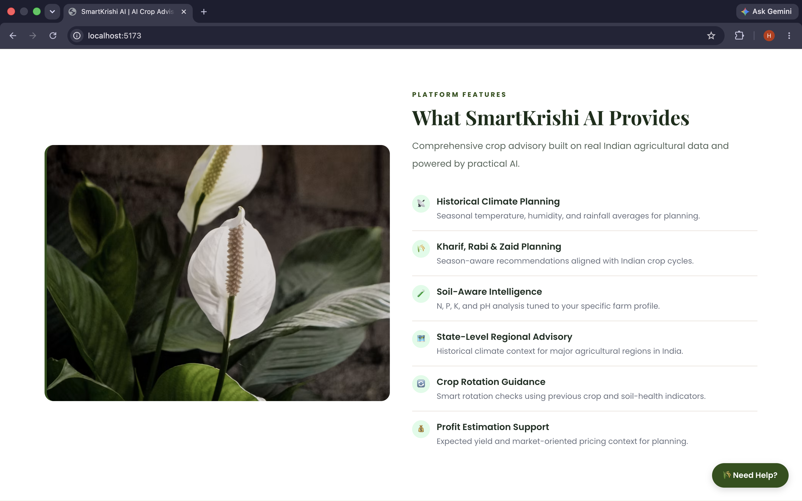
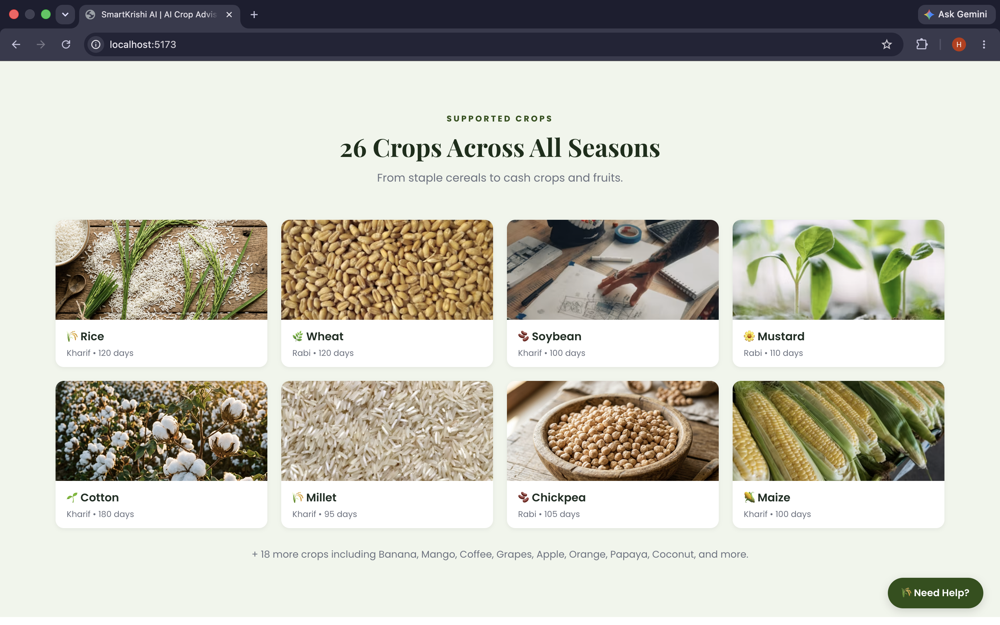
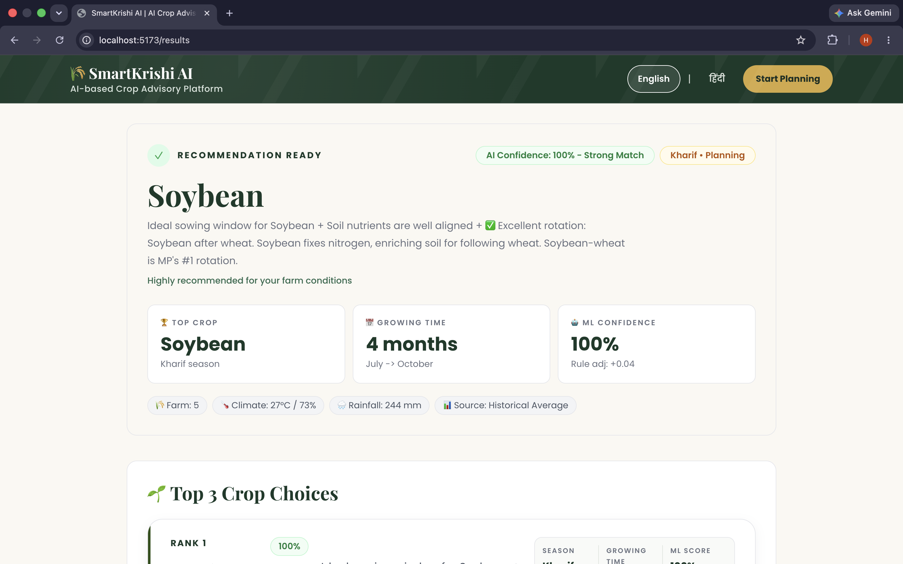
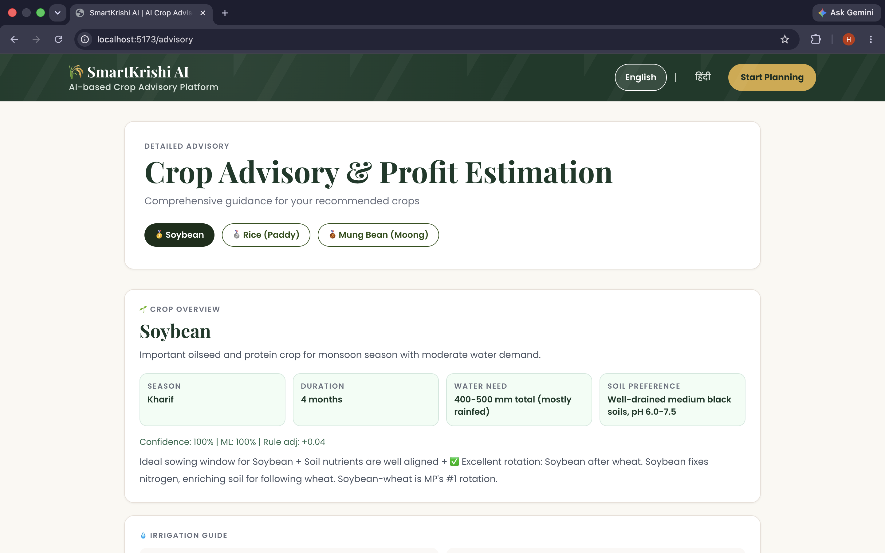
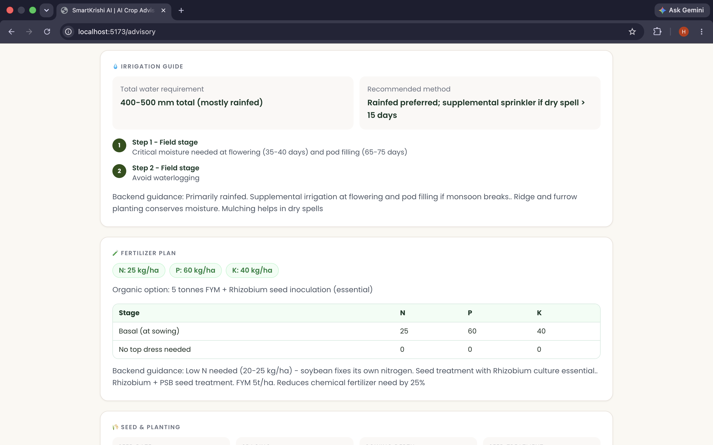
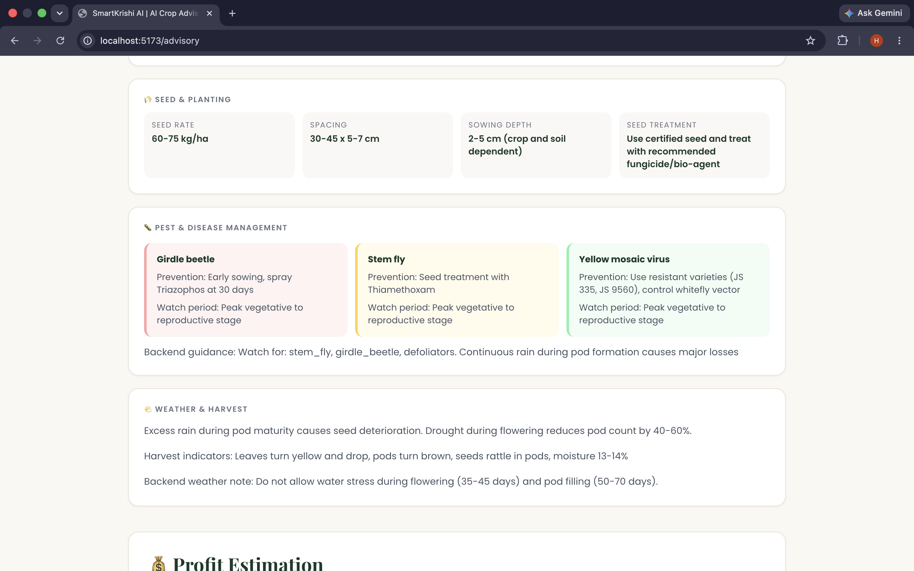
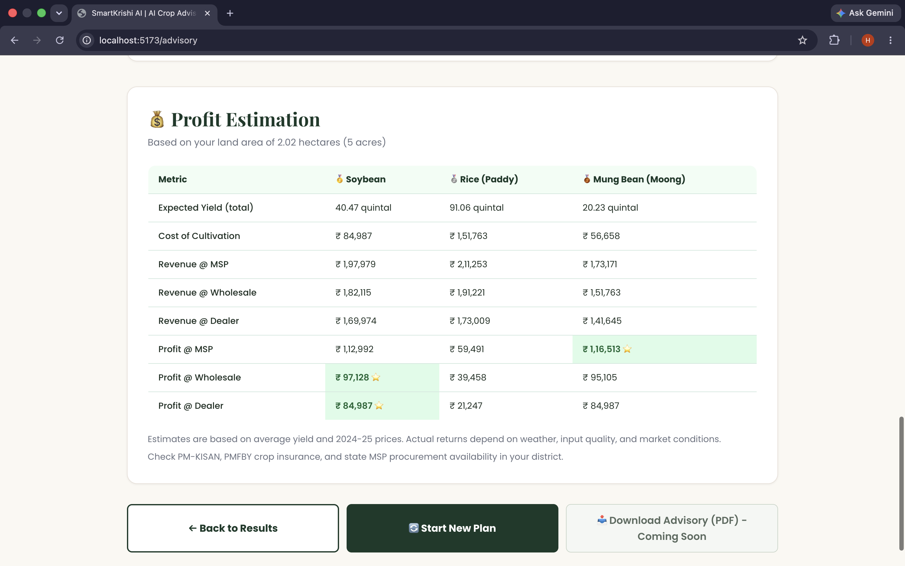

# 🌾 SmartKrishi AI — AI-Powered Crop Advisory for Indian Farmers

AI-powered crop recommendation platform with irrigation, fertilizer, pest management, and profit estimation guidance — built for Indian farming conditions.

---

## 📸 Screenshots

### 🏠 Landing Page

#### Hero Section


#### How It Works


#### Platform Features


#### Supported Crops


---

### 🤖 Crop Recommendation Module

#### Recommendation Results


#### Detailed Crop Advisory


#### Irrigation & Fertilizer Plan


#### Pest & Disease Management


#### Profit Estimation


---

## ✨ Features

- 🌱 Crop recommendation using ML (`N, P, K, humidity, rainfall`)
- 🎯 Prediction-time personalization (`farm_size, previous_crop, season`)
- 🌦️ Historical climate inputs for seasonal planning (temperature, humidity, rainfall)
- 📋 Farming guidance cards (irrigation, fertilizer, pest, weather tips)
- 💰 Profit estimation with MSP, wholesale & dealer pricing
- 🌍 Bilingual support (English & Hindi)

## 🛠️ Tech Stack

| Layer     | Technology                      |
|-----------|----------------------------------|
| Frontend  | React 18 + Vite + Tailwind CSS  |
| ML        | Python + scikit-learn + XGBoost |
| API       | FastAPI + Uvicorn               |

## 📁 Project Structure

```text
src/
  pages/          # Home, Predict, Results, Advisory
  hooks/          # Custom React hooks
  components/     # Reusable UI components
  lib/            # Utility functions
  data/           # Crop advisory & economics JSON
  i18n/           # Internationalization (en/hi)
ml/
  train_crop_model.py
  recommend_crop.py
  api_server.py
  requirements.txt
dataset/
models/
```

## 🚀 Setup

### 1) Install frontend dependencies

```bash
npm install
```

### 2) Train model (if not already trained)

```bash
npm run train:model
```

### 3) Install Python dependencies for API

```bash
pip3 install -r ml/requirements.txt
```

## ▶️ Run

Start API server:

```bash
npm run api
```

Start frontend (new terminal):

```bash
npm run dev
```

Frontend runs on `http://localhost:5173`
API runs on `http://127.0.0.1:8000`

Vite proxies `/api/*` to the API server in development.

## 🔧 Troubleshooting

- Error: `No module named 'numpy._core'`
  - Cause: model artifact was created with a different Python/NumPy build.
  - Fix:
    1. Stop API server.
    2. Rebuild model in current environment: `npm run train:model`
    3. Restart API: `npm run api`
    4. Verify: `curl http://127.0.0.1:8000/health`

- Error: `Could not find a version that satisfies the requirement numpy>=1.26.0`
  - Cause: pip is tied to an older Python interpreter.
  - Fix:
    1. Check: `python3 --version`
    2. Install with interpreter-bound pip: `python3 -m pip install -r ml/requirements.txt`

## 📡 API

- `GET /health`
- `GET /api/health`
- `POST /api/recommend?top_k=5`

Sample body:

```json
{
  "N": 90,
  "P": 42,
  "K": 43,
  "humidity": 80,
  "rainfall": 210,
  "temperature": 24,
  "ph": 6.5,
  "farm_size": 2.5,
  "previous_crop": "rice",
  "season": "kharif"
}
```

Notes:

- The trained model uses `N`, `P`, `K`, `humidity`, and `rainfall`.
- `farm_size`, `season`, and `previous_crop` are applied during inference to personalize the ranked recommendations.
- `temperature` and `ph` are still accepted by the API so the existing frontend flow can keep using them for UI/advisory context.
